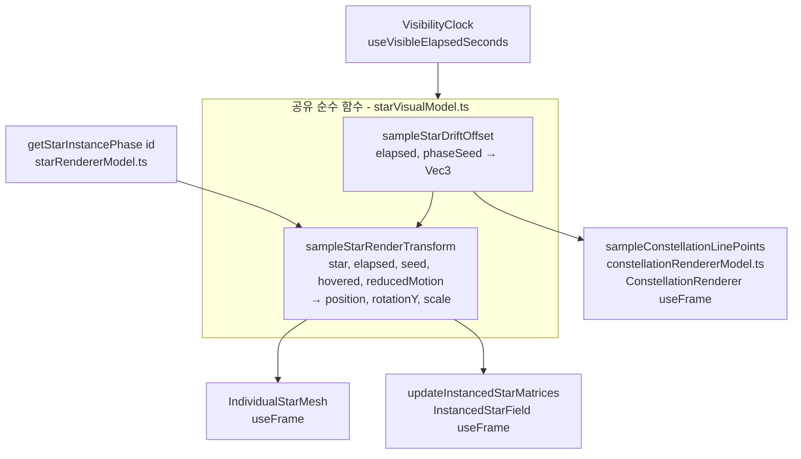
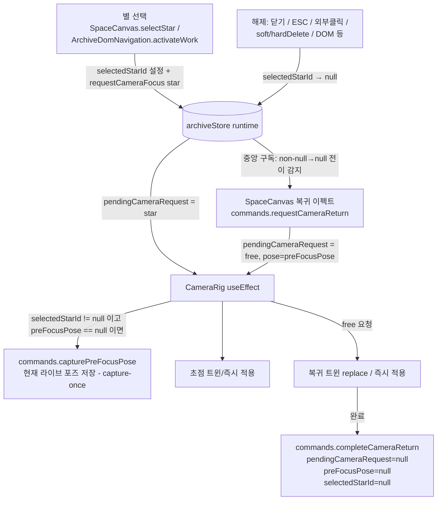

# 설계 문서

## 개요

이 설계는 요구사항 문서의 두 기능을 기존 코드베이스(React + react-three-fiber, zustand)에 최소·일관 변경으로 구현하기 위한 것이다.

1. **자연스러운 별 표류(Star Drift):** 기존 Y축 단일 진동을 제거하고, 시간과 별 식별자에서 결정적으로 파생되는 경계가 보장된 3축 표류로 대체한다. 개별 렌더러와 인스턴스 렌더러가 **동일한 순수 함수**를 공유하고, 별자리 선 끝점도 같은 함수로 표류를 재계산하여 시각적 어긋남을 원천 차단한다.
2. **선택 해제 시 자유 시점 복귀(Camera Return):** 별 초점을 시작하기 직전의 카메라 자세(Pre_Focus_Pose)를 런타임 상태에 캡처하고, `selectedStarId` 가 `null` 이 아닌 값에서 `null` 로 전환되는 모든 경로에서 중앙 집중식으로 복귀를 트리거한다. 복귀는 기존 `pendingCameraRequest` / `CameraRig` / `CameraTweenController` 아키텍처를 그대로 재사용하는 새 요청 변형(`{ type: 'free', pose }`)으로 표현한다.

설계 원칙: 기존의 "명령(commands) → `pendingCameraRequest` → `CameraRig`(순수 적용자)" 흐름과 "순수 모델 함수 + 렌더러가 프레임마다 호출" 패턴을 유지하고, 위치 계산은 항상 단일 공유 함수를 거치도록 한다.

## 아키텍처

### 표류 계산 경로



핵심은 **모든 위치 계산이 `sampleStarDriftOffset` 하나를 거친다**는 점이다. 별(개별/인스턴스)과 별자리 선이 같은 `(elapsed, getStarInstancePhase(id))` 입력으로 동일 오프셋을 얻으므로 요구사항 2.1/2.3(끝점 일치)이 구조적으로 보장된다.

### 카메라 복귀 경로



`CameraRig` 는 여전히 `pendingCameraRequest` 만 보고 동작하는 순수 적용자로 남으며, 복귀는 새 요청 변형을 통해 기존 트윈 로직을 재사용한다.

## 컴포넌트 및 인터페이스

### 1. 공유 표류 모델 (`src/scene/starVisualModel.ts`)

기존 `STAR_OSCILLATION_*` 상수와 `sampleStarMotion`(Y 단일 진동)을 제거하고 다음을 추가한다.

```ts
// 표류 상수 (경계 증명은 아래 "표류 수학" 참조)
export const STAR_DRIFT_AMPLITUDE = 0.34;                 // 축별 진폭 A (유닛)
export const STAR_DRIFT_ANGULAR_FREQUENCIES = {           // 축별 각속도 ω (rad/s)
  x: 0.21,
  y: 0.24,
  z: 0.27,
} as const;
export const STAR_DRIFT_AXIS_PHASE_OFFSETS = {            // 축 간 위상 분리
  x: 0,
  y: (2 * Math.PI) / 3,
  z: (4 * Math.PI) / 3,
} as const;

export interface StarRenderTransform {
  position: Vec3;
  rotationY: number;
  scale: number;
}

/** 시간·별 위상 시드에서 결정적으로 파생되는 경계 보장 3축 표류 오프셋(순수). */
export function sampleStarDriftOffset(
  elapsedVisibleSeconds: number,
  phaseSeed: number,
): Vec3;

/**
 * 개별/인스턴스 렌더러가 공유하는 단일 변환 함수.
 * reducedMotion=true 이면 오프셋을 정확히 0으로 두어 Base_Position 에 고정한다.
 */
export function sampleStarRenderTransform(
  star: Star,
  elapsedVisibleSeconds: number,
  phaseSeed: number,
  hovered: boolean,
  reducedMotion: boolean,
): StarRenderTransform;
```

- `STAR_ROTATION_RADIANS_PER_SECOND`(π/6)은 유지하며 `rotationY = elapsedVisibleSeconds * STAR_ROTATION_RADIANS_PER_SECOND` 로 계속 계산한다(요구사항 1.9).
- `reducedMotion` 이 true면 `position = star.position`(오프셋 0), `rotationY = 0`(시계가 멈춰 있으므로 elapsed=0과 동일)로 반환한다(요구사항 1.7). 이는 인스턴스 경로가 `t=0` 에서도 `sin(phase)≠0` 로 미세 이동하던 기존 불일치를 함께 해소한다.
- 입력 검증(유한/비음수)은 기존 `sampleStarMotion` 과 동일한 `RangeError` 규칙을 따른다.

### 2. 렌더러 모델 (`src/scene/starRendererModel.ts`)

- `sampleStarInstanceTransform` 를 공유 `sampleStarRenderTransform` 호출로 재작성한다(오실레이션 상수 import 제거, `reducedMotion` 인자 추가).
- `updateInstancedStarMatrices` 에 `reducedMotion: boolean` 인자를 추가해 각 인스턴스에 전달한다.
- `getStarInstancePhase`(FNV 계열 해시)를 위상 시드로 계속 사용한다(요구사항 1.4의 결정적 파생). 개별 경로도 이제 이 시드를 사용하므로 두 경로가 완전히 일치한다.

### 3. 개별 렌더러 (`src/scene/IndividualStarMesh.tsx`)

- `sampleStarMotion` 대신 `sampleStarRenderTransform(star, elapsed, getStarInstancePhase(star.id), hovered, reducedMotion)` 를 사용한다.
- `useFrame` 에서 3축 모두 갱신:
  ```ts
  const t = sampleStarRenderTransform(star, elapsedVisibleSeconds.current,
    phaseSeed, hovered, reducedMotion);
  group.position.set(t.position.x, t.position.y, t.position.z);
  group.rotation.y = t.rotationY;
  ```
  (기존에는 `position.y` 와 `rotation.y` 만 갱신했다.)
- `reducedMotion` 은 `StarRenderer` 를 통해 prop으로 전달받는다(아래 4 참조).

### 4. 렌더러 배선 (`src/scene/StarRenderer.tsx`, `InstancedStarField.tsx`)

- `StarRenderer` 에 `reducedMotion: boolean` prop을 추가하고 `IndividualStarMesh` / `InstancedStarField` 로 전달한다.
- `SpaceScene` 은 이미 보유한 `reducedMotion` 값을 `StarRenderer` 로 넘긴다.
- `InstancedStarField` 는 `updateInstancedStarMatrices(..., reducedMotion)` 및 라벨 위치 계산(`sampleStarRenderTransform`)에 `reducedMotion` 을 반영한다.

### 5. 별자리 선 (`src/scene/constellationRendererModel.ts`, `ConstellationRenderer.tsx`)

프레임마다 표류를 반영하도록 다음 순수 함수를 추가한다.

```ts
/** 활성 별들의 현재 표류가 반영된 선 끝점을 별 위치와 동일 공식으로 산출(순수). */
export function sampleConstellationLinePoints(
  activeStars: readonly Star[],
  elapsedVisibleSeconds: number,
  reducedMotion: boolean,
): LinePoint[];
// 각 별 s 에 대해: base(s.position) + sampleStarDriftOffset(elapsed, getStarInstancePhase(s.id))
// reducedMotion=true 이면 base 그대로.
```

`ActiveConstellationLine` 은 drei `<Line>` 의 ref(`Line2`)를 확보하고 `useFrame` 에서 `line.geometry.setPositions(flatPoints)` 로 끝점을 갱신한다(글로우/본선 두 Line 모두). 라벨 위치는 갱신된 끝점으로 `calculateConstellationLabelPosition` 을 재계산한다. `ConstellationRenderer` 는 이미 `<VisibilityClock>` 하위에 있으므로 `useVisibleElapsedSeconds` 를 사용할 수 있고, `reducedMotion` 은 prop으로 전달받는다. 초기 `points` 는 기존 `createConstellationLineViewModels`(base 위치)로 생성하고 프레임에서 표류를 덮어쓴다.

> 별과 선이 동일한 `sampleStarDriftOffset(elapsed, getStarInstancePhase(id))` 를 사용하므로 어긋남이 발생할 수 없다(요구사항 2.1/2.3). 이는 단위/속성 테스트로 직접 검증한다.

### 6. 카메라 상태·명령 (`src/domain/models.ts`, `defaultState.ts`, `store/archiveStore.ts`)

`CameraPose` 는 현재 `cameraMath.ts` 에 정의되어 여러 곳에서 import된다. 상태에서 사용하기 위해 이를 `models.ts` 로 이동하고 `cameraMath.ts` 는 재-export하여 기존 import 경로를 모두 보존한다(호환성 유지).

```ts
// models.ts
export interface CameraPose {
  position: Vec3;
  target: Vec3;
}

export type CameraRequest =
  | { type: 'star'; starId: string }
  | { type: 'constellation'; constellationId: string }
  | { type: 'free'; pose: CameraPose };          // 신규: 자유 시점 복귀

export interface RuntimeStore {
  // ...기존 필드...
  pendingCameraRequest: CameraRequest | null;
  preFocusPose: CameraPose | null;               // 신규: 초점 이전 자세
}
```

`defaultState.ts` 의 `createDefaultRuntimeStore` 에 `preFocusPose: null` 을 추가한다.

`archiveStore.ts` 의 `ArchiveCommands` 에 다음 명령을 추가한다.

```ts
capturePreFocusPose(pose: CameraPose): void;   // preFocusPose 가 null 일 때만 저장(capture-once)
requestCameraReturn(): void;                    // preFocusPose 가 있으면 pendingCameraRequest = { type:'free', pose } 설정
completeCameraReturn(): void;                   // pendingCameraRequest=null, preFocusPose=null, selectedStarId=null
```

- `capturePreFocusPose`: `runtime.preFocusPose === null` 인 경우에만 설정한다. 이로써 별 A→B 전환 시 덮어쓰지 않아 요구사항 3.5를 만족한다.
- `requestCameraReturn`: `runtime.preFocusPose` 가 `null` 이면 아무 것도 하지 않고, 있으면 `{ type: 'free', pose: preFocusPose }` 로 `pendingCameraRequest` 를 설정한다.
- `clearCameraRequest` 는 기존 시그니처를 유지한다(별/별자리 완료 시 사용). 복귀 완료는 `completeCameraReturn` 이 전담하여 `preFocusPose` 까지 정리한다(요구사항 3.6). `requestCameraFocus` 의 기존 star/constellation 검증 로직은 그대로 두고, `'free'` 는 검증 대상이 아니므로 `requestCameraReturn` 이라는 별도 명령으로만 생성한다.

### 7. CameraRig (`src/scene/CameraRig.tsx`)

`CameraRigProps` 에 다음을 추가한다.

```ts
selectedStarId: string | null;
onCapturePreFocusPose?: (pose: CameraPose) => void;   // = commands.capturePreFocusPose
```

`request` 처리 `useEffect` 를 다음과 같이 확장한다.

1. `request === null` 이면 반환(기존).
2. `request.type === 'free'` 인 경우:
   - `resolveCameraFocusRequest` 를 거치지 않고 `destination = request.pose` 로 직접 사용한다.
   - `reducedMotion` 이면 `applyPose(destination)` 즉시 적용 후 `onRequestCompleted(request)`(요구사항 4.2).
   - 아니면 `tweenController.replace(currentPose, destination)` 로 **진행 중 초점 트윈을 현재 자세에서 시작하는 복귀 트윈으로 교체**한다(요구사항 4.3). 지속시간은 기본값 `CAMERA_FOCUS_DURATION_SECONDS`(0.7초)·`cubicEaseInOut` 그대로(요구사항 4.1).
3. `request.type === 'star'` 인 경우(기존 흐름) + **캡처**: `currentPose` 를 읽은 직후, `selectedStarId !== null` 이면 `onCapturePreFocusPose?.(currentPose)` 를 호출한다. capture-once는 명령 쪽에서 보장하므로 CameraRig는 조건 없이 호출해도 되지만, `selectedStarId !== null` 게이트로 **선택이 아닌 초점(예: `ListView` 의 별 초점)** 에서는 캡처하지 않는다. 이후 reducedMotion/트윈 분기는 기존과 동일.
4. `constellation` 은 기존과 동일.

`useFrame` 완료 콜백은 기존대로 `onRequestCompleted(completedRequest)` 를 호출한다. 완료된 요청의 타입에 따른 정리는 상위(`SpaceScene`)에서 라우팅한다(아래 8).

### 8. 씬 배선 (`src/scene/SpaceCanvas.tsx`)

**복귀 트리거(중앙 집중):** `SpaceCanvas` 함수 컴포넌트에서 `selectedStarId` 의 이전 값을 `useRef` 로 추적하고 `useEffect` 로 전이를 감지한다.

```ts
const prev = useRef<string | null>(null);
useEffect(() => {
  if (prev.current !== null && selectedStarId === null) {
    store.getState().commands.requestCameraReturn();   // 진입 경로 무관 복귀
  }
  prev.current = selectedStarId;
}, [selectedStarId, store]);
```

`selectedStarId` 는 스토어 단일 소스이므로, 닫기 버튼·ESC·외부 클릭(`WorkCard`), 소프트/하드 삭제(`archiveStore` 의 `applyRuntime`), `ArchiveDomNavigation` 등 **어느 경로에서 null로 바뀌든** 이 이펙트가 균일하게 복귀를 트리거한다(요구사항 3.3/3.4). 이 이펙트는 `Canvas` 마운트 여부와 무관하게 항상 실행되는 `SpaceCanvas` 최상위에 둔다.

**완료 라우팅:** `SpaceScene` 의 콜백을 요청 타입에 따라 분기한다.

```ts
const onCameraRequestSettled = useCallback((request: CameraRequest) => {
  if (request.type === 'free') store.getState().commands.completeCameraReturn();
  else store.getState().commands.clearCameraRequest();
}, [store]);
```

`CameraRig` 의 `onRequestCompleted` / `onRequestRejected` 에 이 콜백을 연결한다(free는 거부 경로가 없다). `onCapturePreFocusPose` 에는 `commands.capturePreFocusPose` 를, `selectedStarId` prop을 `CameraRig` 로 전달한다. `SpaceScene` 은 `StarRenderer` 로 `reducedMotion` 을 전달한다.

**초점 타깃 고정(요구사항 2.2):** `selectStar` 와 `resolveCameraFocusRequest` 는 변경하지 않는다. 별 초점 목적지는 요청 시점의 `star.position`(Base_Position 스냅샷)에서 `calculateStarFocusPose` 로 한 번 계산되며, 이후 별이 표류해도 타깃은 이동하지 않는다(확정 결정 3: "선택 시점의 별 위치로 고정"). 표류 크기가 0.6 유닛 이내로 작아 카메라 지터 없이 자연스럽다.

## 데이터 모델

| 위치 | 변경 | 목적 |
|------|------|------|
| `models.ts` | `CameraPose` 이동/정의 | 상태에서 포즈 표현 |
| `models.ts` | `CameraRequest` 에 `{ type:'free'; pose }` 추가 | 복귀 요청 표현 |
| `models.ts` | `RuntimeStore.preFocusPose: CameraPose \| null` | Pre_Focus_Pose 저장 |
| `defaultState.ts` | `preFocusPose: null` 초기값 | 기본 런타임 상태 |
| `starVisualModel.ts` | `STAR_DRIFT_*` 상수, `StarRenderTransform`, `sampleStarDriftOffset`, `sampleStarRenderTransform` 추가 / `STAR_OSCILLATION_*`, `sampleStarMotion`, `StarMotionSample` 제거 | 3축 표류 |
| `constellationRendererModel.ts` | `sampleConstellationLinePoints` 추가 | 선 끝점 표류 동기화 |
| `cameraMath.ts` | `CameraPose` 를 `models.ts` 에서 재-export | 기존 import 보존 |

`preFocusPose` 는 UI에 표시되는 값이 아니라 카메라 제어용 순간 상태이므로 **`persisted` 가 아닌 `runtime` 에만** 둔다. 따라서 저장 스키마(`persistedStateCodec`)와 `schemaVersion` 은 변경하지 않는다.

## 표류 수학 (경계 증명)

각 축 오프셋을 사인 함수로 정의한다. `t = elapsedVisibleSeconds`, `s = phaseSeed`, `A = STAR_DRIFT_AMPLITUDE = 0.34`.

```
offset_x(t) = A · sin(ω_x · t + s + φ_x)
offset_y(t) = A · sin(ω_y · t + s + φ_y)
offset_z(t) = A · sin(ω_z · t + s + φ_z)
```

- `ω = (ω_x, ω_y, ω_z) = (0.21, 0.24, 0.27)` rad/s (주기 약 30·26·23초로 매우 느림).
- `(φ_x, φ_y, φ_z) = (0, 2π/3, 4π/3)` (축 간 위상 분리로 자연스러운 3차원 곡선).
- `s = getStarInstancePhase(star.id) ∈ [0, 2π)` (별마다 다른 위상 → 요구사항 1.4).

**크기 경계(요구사항 1.2):** 각 축 `|offset_i| ≤ A` 이므로
`|offset| = √(x²+y²+z²) ≤ A·√3 = 0.34 × 1.7320… = 0.5889 < 0.6`. ✅

**속도 경계(요구사항 1.3, 1.5):** 속도 성분 `v_i(t) = A · ω_i · cos(…)`, `|cos| ≤ 1` 이므로
`|v(t)| = √(Σ (A·ω_i·cos)²) ≤ A·√(ω_x²+ω_y²+ω_z²)`.
`ω_x²+ω_y²+ω_z² = 0.0441+0.0576+0.0729 = 0.1746`, `√0.1746 = 0.4179`.
`A·0.4179 = 0.34 × 0.4179 = 0.1421 < 0.15` 유닛/초. ✅
동일 상한이 립시츠 상수이므로 `|offset(t+Δ) − offset(t)| ≤ 0.1421·Δ` → 인접 프레임 간 연속(불연속 도약 없음, 요구사항 1.5). ✅

**연속성·위상 진행(요구사항 1.1, 1.8):** `sin` 은 연속이며 오프셋은 `t` 의 연속 함수다. `t` 는 `VisibleElapsedClock` 이 누적하는 값으로 화면이 숨겨진 구간에는 증가하지 않으므로 위상도 그 구간 동안 정지한다. 함수는 `t` 만 입력받아 결정적이다.

**결정성(요구사항 1.4):** 동일 `(t, s)` → 동일 오프셋. `s` 는 id 해시로 파생되어 별마다 상이. ✅

이 상수들은 여유(0.589 < 0.6, 0.142 < 0.15)를 두어 부동소수점 오차에도 경계를 위반하지 않는다.

## Correctness Properties

*속성(property)이란 시스템의 모든 유효한 실행에서 참이어야 하는 특성이나 동작으로, 시스템이 무엇을 해야 하는지에 대한 형식적 진술이다. 속성은 사람이 읽는 명세와 기계가 검증 가능한 정확성 보증 사이의 다리 역할을 한다.*

### Property 1: 표류 오프셋 크기 경계

*임의의* 유한한 비음수 `elapsedVisibleSeconds` 와 임의의 위상 시드에 대해, `sampleStarDriftOffset` 의 결과 벡터 크기는 0.6 유닛 이하이며 유한하고 시간에 따라 변한다.

**Validates: Requirements 1.1, 1.2**

### Property 2: 표류 속도·연속성 경계

*임의의* 유한한 비음수 `elapsedVisibleSeconds` 와 임의의 위상 시드, 그리고 임의의 작은 양의 `Δ` 에 대해, `‖sampleStarDriftOffset(t+Δ) − sampleStarDriftOffset(t)‖ ≤ 0.15·Δ`(수치 허용오차 포함) 를 만족한다(순간 속도 ≤ 0.15 유닛/초이자 불연속 도약 없음).

**Validates: Requirements 1.3, 1.5**

### Property 3: 식별자 기반 결정성

*임의의* 별 식별자와 임의의 `elapsedVisibleSeconds` 에 대해, 동일한 입력으로 두 번 표류를 샘플링하면 동일한 오프셋을 산출하며, 서로 다른 식별자는 서로 다른 위상 시드를 갖는다.

**Validates: Requirements 1.4, 1.8**

### Property 4: 렌더러 간 통일된 표류

*임의의* 별과 임의의 `elapsedVisibleSeconds` 에 대해, 개별 렌더러 경로와 인스턴스 렌더러 경로가 산출하는 렌더링 위치(및 회전)는 동일하다(두 경로가 동일한 `sampleStarRenderTransform` 를 사용).

**Validates: Requirements 1.6**

### Property 5: 모션 축소 시 기준 위치 고정

*임의의* 별과 임의의 `elapsedVisibleSeconds` 에 대해, `reducedMotion` 이 활성이면 렌더링 위치는 Base_Position 과 정확히 일치한다(오프셋 0).

**Validates: Requirements 1.7**

### Property 6: 자전 각속도 보존

*임의의* 유한한 비음수 `elapsedVisibleSeconds` 에 대해, 산출되는 `rotationY` 는 `elapsedVisibleSeconds × (π/6)` 과 같다.

**Validates: Requirements 1.9**

### Property 7: 별자리 선 끝점과 렌더링 위치 일치

*임의의* 별 집합과 임의의 `elapsedVisibleSeconds` 에 대해, `sampleConstellationLinePoints` 가 산출하는 각 끝점은 해당 별의 렌더링 위치(Base_Position + 동일 표류 오프셋)와 정확히 일치한다.

**Validates: Requirements 2.1, 2.3**

### Property 8: 초점 타깃은 선택 시점 위치로 고정

*임의의* 별 위치에 대해, `resolveCameraFocusRequest` 로 해석된 별 초점 요청의 타깃 위치는 요청 시점의 `star.position` 과 동일하며, 이후 표류와 무관하게 변하지 않는다.

**Validates: Requirements 2.2**

### Property 9: Pre_Focus_Pose 캡처-원스

*임의의* 초기 카메라 포즈에 대해, 첫 별 초점 진입 시 저장된 `preFocusPose` 는 진입 직전 포즈와 동일하며, 이미 `preFocusPose` 가 저장된 상태에서 다시 `capturePreFocusPose` 를 호출해도 값이 변하지 않는다.

**Validates: Requirements 3.2, 3.5**

## 오류 처리

- **입력 검증:** `sampleStarDriftOffset` / `sampleStarRenderTransform` 는 `elapsedVisibleSeconds` 가 유한·비음수, `phaseSeed` 가 유한임을 검사하고 위반 시 `RangeError` 를 던진다(기존 `sampleStarMotion`·`sampleStarInstanceTransform` 규칙 계승).
- **복귀 요청에 Pre_Focus_Pose 부재:** `requestCameraReturn` 은 `preFocusPose === null` 이면 아무 것도 하지 않는다(예: `ListView` 처럼 선택 없이 초점만 이동한 경우 캡처가 없었으므로 복귀 대상 없음). 이때 `selectedStarId` 는 이미 `null` 이므로 상태는 일관된다.
- **free 요청 해석:** `CameraRig` 는 `'free'` 요청을 `resolveCameraFocusRequest` 로 보내지 않으므로 거부(reject)될 수 없다. 포즈는 이미 검증된 유한 좌표(캡처 시점의 카메라/컨트롤 값)다.
- **트윈 교체 안전성:** 진행 중 트윈이 있는 상태에서 복귀가 요청되면 `CameraTweenController.replace` 가 이전 트윈을 원자적으로 폐기하고 현재 자세에서 새 트윈을 시작하므로 자세 점프가 없다.
- **선택된 별 삭제:** `hardDelete`/`softDelete` 의 기존 `applyRuntime` 이 `selectedStarId` 를 `null` 로 만들면 중앙 복귀 이펙트가 자연히 복귀를 트리거한다(별도 처리 불필요).

## 테스트 전략

이 기능의 핵심 로직(표류 수학, 포즈 캡처/복원 상태 전이)은 순수 함수와 스토어 명령으로 분리되어 있어 속성 기반 테스트(PBT)에 적합하다. 3D 렌더링 자체(three.js 행렬 쓰기, drei `<Line>` 지오메트리 갱신)와 컴포넌트 배선은 예시 기반 단위/컴포넌트 테스트로 검증한다.

### 이중 테스트 접근

- **속성 테스트(PBT):** 위 Correctness Properties 1–9. 라이브러리는 저장소에 이미 있는 **fast-check** 를 사용하며, 각 속성은 **단일** 속성 테스트로 구현하고 최소 **100회 반복**한다. 각 테스트에 다음 형식의 주석을 단다: `Feature: natural-star-drift-and-camera-return, Property {번호}: {속성 텍스트}`.
- **단위/예시 테스트:** 표류 상수의 구체 값, 옛 오실레이션 API 부재, 특정 경과 시점의 3축 비영 오프셋, 카메라 완료 정리(3.6), 트윈 교체(4.3), reducedMotion 즉시 적용(4.2).
- **컴포넌트 테스트:** 각 해제 경로(닫기/ESC/외부 클릭/soft·hardDelete/DOM 탐색)에서 `pendingCameraRequest` 가 `{ type:'free', pose: preFocusPose }` 로 설정되는지(3.3/3.4), 다른 별 선택 시 복귀 대신 `star` 요청 유지·`preFocusPose` 불변(3.5), 완료 후 `pendingCameraRequest`/`preFocusPose`/`selectedStarId` 정리(3.6/4.4).

### 속성 ↔ 테스트 매핑 (PBT)

| Property | 대상 함수 | 생성기 요약 |
|----------|-----------|-------------|
| 1 크기 경계 | `sampleStarDriftOffset` | elapsed ∈ [0, 대값], seed ∈ [0, 2π) |
| 2 속도·연속성 | `sampleStarDriftOffset` | elapsed, seed, Δ ∈ (0, 작은값] |
| 3 결정성 | `sampleStarDriftOffset` + `getStarInstancePhase` | 임의 id 문자열, elapsed |
| 4 렌더러 통일 | `sampleStarRenderTransform` (개별) vs 인스턴스 경로 | 임의 별, elapsed |
| 5 모션 축소 | `sampleStarRenderTransform(reducedMotion=true)` | 임의 별, elapsed |
| 6 자전 | `sampleStarRenderTransform` | 임의 elapsed |
| 7 선 끝점 일치 | `sampleConstellationLinePoints` vs `sampleStarDriftOffset` | 임의 별 배열, elapsed |
| 8 초점 타깃 고정 | `resolveCameraFocusRequest` | 임의 별 위치 |
| 9 캡처-원스 | `capturePreFocusPose` (스토어) | 임의 포즈 두 개 |

### 갱신이 필요한 기존 테스트 (하위 호환 및 리스크)

옛 Y축 오실레이션 API(`STAR_OSCILLATION_*`, `sampleStarMotion`)를 제거하므로 이를 참조하는 테스트를 새 3축 표류 기준으로 재작성해야 한다.

- `src/scene/starVisualModel.test.ts` — 오실레이션 상수/`sampleStarMotion` 단언 제거, 표류 상수·경계·`sampleStarRenderTransform` 로 교체.
- `tests/pbt/rating-visual-star-motion.pbt.test.ts` — `sampleStarMotion` 의 ±0.1/3초 오실레이션 속성을 표류 경계(Property 1·2)로 대체.
- `src/scene/starRendererModel.test.ts` — `sampleStarInstanceTransform` 의 예상 좌표(예: `y: 7.1`)를 새 표류·`reducedMotion` 인자 시그니처로 갱신, `updateInstancedStarMatrices` 호출부에 `reducedMotion` 반영.
- `src/scene/SceneInteractionLifecycle.component.test.tsx` — `sampleStarMotion`/`sampleStarInstanceTransform` import와 위치 단언을 새 API로 갱신. `resolveCameraFocusRequest`(초점 타깃) 관련 단언은 변경 없음.
- `src/scene/cameraMath.test.ts` — `CameraPose` 가 `models.ts` 재-export로 유지되므로 import는 그대로 동작. 필요 시 `'free'` 요청은 `cameraMath` 가 아닌 `CameraRig`/스토어에서 다루므로 `resolveCameraFocusRequest` 테스트는 영향 없음.

**하위 호환 리스크 점검:**

- `src/components/ArchiveOverview.component.test.tsx`(라인 248–258)와 `WorkManagement.component.test.tsx` 는 **초점(focus) 시점**의 `pendingCameraRequest`(star/constellation)를 단언한다. 초점 흐름은 변경하지 않으므로 통과가 유지된다.
- `WorkManagement.component.test.tsx` 는 `WorkCard` 를 **단독 렌더**하고 닫기/ESC 시 `persisted` 불변만 단언한다. 복귀 트리거는 `SpaceCanvas` 최상위 이펙트에 있으므로 `WorkCard` 단독 테스트에는 영향이 없다(닫기 시 `pendingCameraRequest` 를 단언하지 않음).
- 새로 추가되는 리스크: `SpaceCanvas` 전체를 렌더해 선택→해제 시나리오를 검증하는 기존 테스트가 있다면, 해제 후 `pendingCameraRequest` 가 `null` 이 아니라 `'free'` 요청으로 채워진다. 해당 단언이 있으면 새 동작 기준으로 갱신해야 한다(요구사항 3.3/3.6).
- `preFocusPose` 는 `runtime` 전용이라 저장 스키마 테스트(`persistedStateCodec.test.ts`)에는 영향이 없다.

### 렌더링 계층(속성 테스트 부적합) 처리

- 인스턴스 행렬 쓰기(`mesh.setMatrixAt`)와 별자리 `<Line>` 지오메트리 프레임 갱신은 three.js/drei 동작에 의존하므로, three 객체를 목(mock)/스텁으로 두고 "공유 샘플러가 반환한 좌표가 그대로 반영되는지"를 1–2개 예시로 확인한다(외부 라이브러리 자체는 재검증하지 않음).
