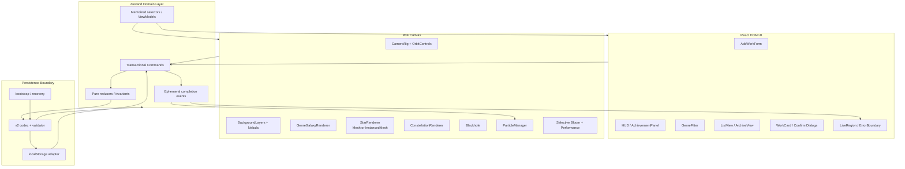
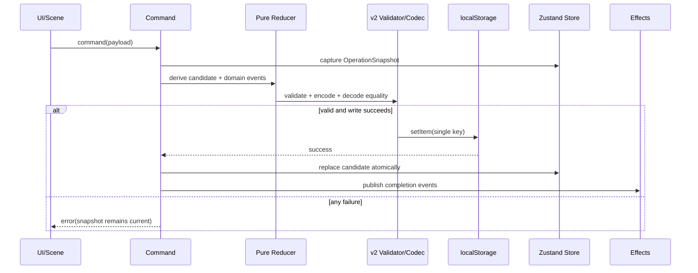

# Technical Design Document

## Overview

`space-movie-archive`는 React + TypeScript UI와 React Three Fiber(R3F) Scene을 하나의 Zustand 도메인 Store 위에 결합하는 로컬 우선(single-user, browser-only) 애플리케이션이다. 모든 제품 동작의 유일한 기준은 `requirements.md`이며, 영속 데이터는 단일 localStorage 키 `space-movie-archive:v2`의 schemaVersion 2 문서로 저장한다.

설계의 핵심 원칙은 다음과 같다.

- **도메인 우선:** UI 이벤트는 Store command를 호출하며, 마일스톤·업적·참조 정리는 command 내부의 순수 reducer에서 계산한다.
- **원자적 사용자 동작:** 사용자 시작 쓰기는 스냅샷 → 후보 상태 계산 → 직렬화/검증 → localStorage 저장 → 메모리 commit → 완료 이벤트 순으로 실행한다. 저장 실패 시 commit과 시각 효과를 발생시키지 않는다.
- **렌더링과 데이터 분리:** Scene은 Store selector로 파생된 view model만 소비한다. Three.js 객체와 파티클은 영속 상태에 들어가지 않는다.
- **결정론:** 배치, 정렬, 색상, 자동 별자리와 복구는 명시적 tie-breaker와 seed를 사용한다.
- **성능 적응:** 활성 작품 수 0~50은 개별 Star mesh, 51 이상은 InstancedMesh를 사용하며, 5초 FPS 창에 따라 정해진 순서로 품질을 낮춘다.
- **접근 가능한 이중 탐색:** 3D 조작과 동등한 선택·삭제·복원·필터 기능을 DOM 기반 Card/ListView/대화상자에서 키보드와 스크린 리더로 제공한다.

### Research findings informing the design

- R3F는 선언적 React 렌더러이므로 Scene 노드를 컴포넌트로 분리하되, 프레임별 변화는 React state가 아니라 `useFrame`과 Three.js 객체 ref에서 처리한다. 공식 성능 가이드는 draw call 감소를 위해 instancing을 권장한다: [R3F Scaling performance](https://r3f.docs.pmnd.rs/advanced/scaling-performance).
- drei `PerformanceMonitor`는 평균 FPS 기반 decline/incline callback을 제공하지만, 본 요구사항의 정확한 5초 구간과 단방향 3단계 저하를 보장하기 위해 같은 원리의 전용 `FpsDegradationController`를 사용한다: [drei PerformanceMonitor](https://drei.docs.pmnd.rs/performances/performance-monitor).
- `@react-three/postprocessing`은 R3F용 후처리 체인을 제공한다. Bloom 대상은 별/활성 별자리 라인에만 emissive/layer 마킹하고 대상이 없을 때 composer의 Bloom pass를 제거한다: [react-postprocessing](https://github.com/pmndrs/react-postprocessing).
- Zustand는 Store를 React 밖에서도 다룰 수 있어 transactional command와 selector 경계를 만들기 적합하다: [Zustand](https://github.com/pmndrs/zustand).

위 자료의 내용은 라이선스 준수를 위해 요약·재서술했다.

## Architecture



### Runtime boundaries

1. **Bootstrap boundary:** React mount 전에 `PersistenceService.load()`를 호출한다. 완전한 v2 검증과 encode/decode 동등성 검사가 성공한 경우에만 복원하며, 실패 시 기본 상태를 사용한다. `hasPersistedRegistration`이 false인 최초 실행은 메모리 fixture가 있더라도 등록 Star/Constellation view model을 비운다.
2. **Domain boundary:** Store만 영속 엔티티를 변경할 수 있다. UI/Scene은 ID와 command payload만 전달한다.
3. **Persistence boundary:** 브라우저 API는 `StorageAdapter` 뒤에 숨긴다. 사용자 command는 동기적 localStorage 저장 성공 후 한 번에 Store를 교체한다. 백그라운드 autosave는 최대 1초 debounce이며 실패 시 메모리를 유지하고 진단 상태만 기록한다.
4. **Rendering boundary:** Scene은 파생 배열을 렌더링하고, object disposal·animation clock·hover mapping은 전용 runtime registry가 관리한다.
5. **Effect boundary:** 파티클/알림은 commit 후 생성한 ephemeral event만 소비한다. 복원 시 이벤트를 만들지 않는다.

### Deterministic defaults

요구사항이 열어 둔 비핵심 선택은 다음으로 고정한다.

- 카메라 이동 시간 0.7초, cubic ease-in-out, 최대 거리 1000.
- Star 위치는 `UUID + genre`를 seed로 한 `xorshift32`를 사용해 균일 구 부피 샘플링하며 반경은 `min(placementRadius, 10)`이다.
- 기본 장르 은하 중심은 최소 중심 간 거리 25를 만족하는 고정 상수 테이블이다. 저장 데이터에서 이 제약이 깨지면 문서 전체를 손상으로 판정한다.
- 별자리 색상은 고정 팔레트에서 기존 색상과의 CIE 거리 최대 항목을 선택하고, 동률이면 팔레트 순서를 사용한다.
- 자동 별자리 command는 UI event UUID(`operationId`)를 받아 최근 완료 operation ID의 bounded set으로 중복을 차단한다. 이 중복 방지 메타데이터는 세션 상태이며 생성 결과 자체는 영속된다.
- FPS 품질은 세션 동안 자동 상승하지 않는 단방향 단계(`full → reducedBackground → minimumParticles → reducedBloom`)로 유지한다.

## Components and Interfaces

### Application and DOM components

- `AppBootstrap`: 저장 상태를 동기 복원한 뒤 React tree를 mount한다. 복구 경고를 live region에 전달한다.
- `ArchiveShell`: 768px breakpoint 레이아웃만 전환하며 Store/선택 상태는 재생성하지 않는다.
- `AddWorkForm`: trim 전 입력을 로컬 draft로 유지하고 domain validator 결과를 필드별 연결한다. command 실패 시 draft와 Store를 그대로 둔다.
- `HUD`: 활성 수, decimal half-away-from-zero 1자리 평균, 모든 최다 장르, 마일스톤/업적 요약 selector를 소비한다.
- `AchievementPanel`: 진행률은 현재 활성 작품에서 재계산한 값, 해금 메타데이터는 영속 값을 표시한다.
- `GenreFilter`: `Set<Genre>`에 대한 토글을 수행한다. 목표 opacity/intensity가 현재값과 같으면 tween을 만들지 않는다. Requirement 3 상단의 질의는 요구사항 6.13 본문대로 **실제로 비선택인 은하에만** 적용한다.
- `ListView`: active works, active constellations, blackhole archive의 세 section을 제공한다. 검색은 `Normalized_Title`과 `Normalized_Director` substring으로 고정한다.
- `WorkCard`: 선택 Star의 screen projection을 CSS clamp하여 모든 경계에서 8px를 보장한다.
- `ConfirmDialog`: hard/soft delete 영향 별자리 이름 전체를 표시하고 focus trap, Escape, focus restore를 제공한다.
- `ToastRegion`: 각 사용자 쓰기 실패와 최초 해금만 `aria-live="polite"`로 알린다.

### Scene components

- `SpaceCanvas`: `#03040a`, FOV 75 PerspectiveCamera, `OrbitControls(maxDistance=1000)`를 구성한다.
- `VisibilityClock`: `performance.now()` 누적 대신 visible 구간 delta만 누적하여 Background Star, Star, 배경 유성의 phase를 hidden 동안 보존한다.
- `BackgroundLayers`: 정확히 far/near 두 레이어를 하나씩 렌더링한다. camera quaternion 기반 parallax 계수를 `1.0`/`1.5`로 적용하고 각 별은 seed 기반 1~4초, ±30% 진동을 갖는다.
- `NebulaField`: seed로 1~3개를 선택하되 기본값은 2개이며 opacity 0.1~0.5, 지정 색 범위 내 보간색을 사용한다.
- `GenreGalaxyRenderer`: `themeId`에 따라 아래 테마 전략을 선택한다.
- `StarRenderer`: 50개 이하 `IndividualStarMesh`, 51개 이상 `InstancedStarField`로 전환한다.
- `ConstellationRenderer`: `starIds`를 active map으로 필터한 뒤 2개 이상일 때만 순서를 유지한 line을 만든다.
- `CameraRig`: Star focus는 0.7초 보간, constellation focus는 active bounding box에 0.7초 fit한다. 현재 tween은 새 요청 시 취소·교체한다.
- `BlackholeRenderer`: 고정 위치 원반과 제한된 distortion shader를 제공하며 drop target hit testing을 담당한다.
- `ParticleManager`: commit event별 effect factory, 수명, dispose registry를 관리한다.
- `SelectiveBloom`: Star와 active constellation line만 bloom selection에 포함한다. 대상이 0이면 pass를 unmount한다.
- `FpsDegradationController`: requestAnimationFrame 표본의 5초 평균을 산출하고 30fps 미만일 때 한 단계만 낮춘 후 새 5초 창을 시작한다.

### Star/InstancedMesh transition strategy

`StarRenderViewModel[]`은 모드에 독립적이다. 0~50개에서는 Star마다 geometry는 rating별 공유하고 material은 opacity/bloom 등급별 pool에서 참조한다. 51개 이상에서는 rating별 최대 5개의 `THREE.InstancedMesh` bucket으로 나누어 geometry/material을 공유하고 instance matrix/color를 갱신한다. `instanceId → starId` 배열로 raycast hover/click을 역매핑한다. 전환은 동일 프레임에서 새 renderer를 준비한 뒤 이전 renderer를 unmount하며 selection과 camera target은 ID 기반이라 유지된다. Instanced mode의 회전·진동은 공통 clock과 per-instance phase/기준 행렬로 매 프레임 matrix를 갱신한다. 50↔51 전환 시 중복 렌더 프레임을 피하기 위해 mode key로 한 renderer만 commit한다.

### Genre Galaxy / Nebula themes

| Genre | `themeId` | 구현 및 수치 제약 |
|---|---|---|
| SF | `blue-spiral` | `#3B82F6`, 2개 나선 팔, 각 ≥360° |
| 로맨스 | `pink-core-nebula` | `#F472B6`, 중심 50% 밀도 ≥ 외곽의 1.5배, 하트 primitive 금지 |
| 스릴러 | `red-asymmetric-bands` | `#DC2626`, 길이/폭 ≥2인 비대칭 띠 ≥3 |
| 드라마 | `gold-elliptical` | `#F59E0B`, 장축/단축 1.5~2.5 |
| 애니 | `purple-prism` | `#A855F7`, 서로 다른 법선의 반투명 면 ≥3 |
| 코미디 | `yellow-rings` | `#FDE047`, 외경/내경 ≥1.5인 닫힌 고리 ≥2 |
| 액션 | `orange-burst` | `#F97316`, 중심 반경의 1.5배 길이 광선 ≥8 |
| 기타 | `teal-irregular-clusters` | `#14B8A6`, 크기 차 ≥20% 군집 ≥3 |

각 shader/material의 주 색상 contribution을 0.5 이상으로 고정하고 opacity 0.1 미만 fragment는 Visible Theme 측정에서 제외한다. 개발/시각 회귀 테스트에서는 offscreen render mask로 Primary Color Area ≥50%를 계측한다. 테마는 같은 `GalaxyTheme` 인터페이스(`buildGeometry`, `uniforms`, `shapeMetrics`)를 구현한다.

### Domain interfaces

```ts
type Genre = 'SF' | '로맨스' | '스릴러' | '드라마' | '애니' | '코미디' | '액션' | '기타';
type Vec3 = readonly [number, number, number];

type CommandResult<T = void> =
  | { ok: true; value: T; completionEvents: DomainEvent[] }
  | { ok: false; error: DomainError };

interface ArchiveCommands {
  addWork(input: AddWorkInput): CommandResult<{ starId: string }>;
  hardDelete(starId: string): CommandResult;
  softDelete(starId: string): CommandResult;
  restoreArchived(starId: string): CommandResult;
  createConstellation(input: CreateConstellationInput): CommandResult;
  createGenreConstellations(operationId: string): CommandResult;
}

interface PersistenceService {
  load(): LoadResult;
  saveUserAction(candidate: PersistedStateV2): SaveResult;
  scheduleAutosave(state: PersistedStateV2): void;
}
```

### Transaction algorithm



Hard Delete reducer는 target을 `stars`에서 제거하고 모든 constellation의 모든 참조를 순서 보존 filter로 제거하며 archive에는 삽입하지 않는다. Soft Delete reducer는 같은 참조 정리와 함께 `discardedAt`을 추가해 archive로 이동한다. Restore는 archive에서 제거하고 `discardedAt` 없이 stars에 삽입하며 별자리 참조는 복원하지 않는다. 모든 후보 상태는 동일 ID가 두 collection에 동시에 존재하지 않는지 검사한다. 예외적인 rollback 중복은 snapshot의 원래 소속을 우선하여 정규화한다.

### Milestone and achievement engines

`reconcileProgress(previous, candidate, now)`는 작품 collection 변경 command에서만 호출한다.

- 마일스톤은 잠금 상태이고 `previousCount < target && nextCount >= target`일 때만 해금한다. 한 command에서 0→100 이상이면 target 오름차순(50, 100)으로 처리한다. UUID rewardId와 첫 시각은 이후 절대 변경하지 않는다. 50은 planet record, 100은 기존 8개와 구분되는 reward galaxy record를 정확히 하나 upsert한다. 복원은 저장 record를 ID로 dedupe하되 새 이벤트를 발행하지 않는다.
- 업적 진행률은 매번 현재 active stars를 규칙별 `Set<UniqueWorkKey>`로 완전 재계산한다. `UniqueWorkKey = normalize(title) + '::' + normalize(director)`이며 normalize는 `trim().toLocaleLowerCase('und')` 후 Unicode NFC로 고정한다.
- `nolan-master` 규칙은 `normalizedDirector === 'christopher nolan'`, target 10이다. 중복 작품은 Set 때문에 한 편이다. 해금은 sticky이며 진행률은 감소할 수 있다. unlock event는 locked→unlocked 전이에만 생성되고 bootstrap/panel open에는 생성하지 않는다.

## Data Models

```ts
interface StarRecord {
  id: string; // UUID
  title: string;
  normalizedTitle: string;
  genre: Genre;
  rating: 1 | 2 | 3 | 4 | 5;
  review: string;
  watchedDate: string; // valid YYYY-MM-DD
  director: string;
  normalizedDirector: string;
  position: { x: number; y: number; z: number };
  createdAt: string; // ISO 8601
}

interface ConstellationRecord {
  id: string;
  name: string;
  starIds: string[]; // ordered, unique, 2..200 at creation
  color: string;
  createdAt: string;
}

interface ArchivedStarRecord extends StarRecord { discardedAt: string }

type GalaxyKind = { type: 'genre'; genre: Genre } | { type: 'reward'; rewardType: 'milestone-100' };
interface GalaxyState {
  id: string;
  kind: GalaxyKind;
  center: { x: number; y: number; z: number };
  placementRadius: number;
  themeId: string;
  primaryColor: string;
  unlocked: boolean;
}

interface MilestoneState {
  target: 50 | 100;
  unlocked: boolean;
  unlockedAt: string | null;
  rewardId: string | null;
}

interface AchievementState {
  id: string;
  name: string;
  description: string;
  ruleId: string;
  progress: number;
  target: number;
  unlocked: boolean;
  unlockedAt: string | null;
}

interface PersistedStateV2 {
  schemaVersion: 2;
  stars: StarRecord[];
  constellations: ConstellationRecord[];
  blackholeArchive: ArchivedStarRecord[];
  galaxies: GalaxyState[];
  milestoneUnlocks: { fifty: MilestoneState; hundred: MilestoneState };
  achievements: AchievementState[];
}
```

Store는 위 persisted slice 외에 `selectedStarId`, `selectedGenres`, `constellationDraft`, drawer/panel 상태, `qualityLevel`, pending camera request, effect queue, storage diagnostics를 runtime slice로 둔다. runtime slice는 localStorage에 저장하지 않는다. 768px 전환은 DOM CSS/layout state만 바꾸므로 persisted/runtime selection slice를 교체하지 않는다.

### Validation and persistence

수동 TypeScript type guard가 아니라 선언적 v2 schema validator(프로젝트의 기존 검증 라이브러리가 없다면 Zod의 고정 버전)를 `decodePersistedV2` 한 곳에서 사용한다. 검증 범위는 필수 필드, enum/길이/날짜/ISO/UUID, 유한 좌표, rating 정수, 장르 galaxy 8개, 중심 거리, placement distance, milestone null 연계, archive/stars 상호배타성, constellation ID 유일성 및 reward ID 유일성이다. Constellation의 비활성 참조는 복구 가능한 데이터로 허용하되 renderer는 active 참조만 사용한다. Hard/Soft delete 후에는 대상 참조가 남으면 후보를 거부한다.

localStorage의 단일 `setItem`을 문서 교체의 원자 단위로 사용한다. 사용자 command는 Zustand를 먼저 바꾸지 않고 후보 JSON을 먼저 저장하므로 실패 시 OperationSnapshot이 그대로 현재 상태다. 성공 후 `setState(candidate, true)`로 한 번에 commit한다. serialize 직후 같은 codec으로 decode하여 deep equality(배열 순서 포함)를 확인한다. load에서도 parse→validate→canonical encode/decode→deep equality를 통과하지 못하면 부분 복원 없이 기본값으로 복구한다. 백그라운드 autosave는 1초 debounce와 마지막 상태 coalescing을 쓰되 사용자 command 저장과 mutex로 직렬화한다.

### Derived state and sorting

- HUD 평균은 integer rating 합을 사용하고 `Math.round(value * 10 + Number.EPSILON) / 10`에 해당하는 양수 half-away-from-zero 규칙으로 표시한다.
- List rating 정렬: rating desc → createdAt desc → normalizedTitle asc → UUID asc.
- List latest 정렬: createdAt desc → normalizedTitle asc → UUID asc.
- genre 자동 별자리: createdAt asc → UUID asc.
- 검색·필터 결과 수는 별도 캐시 count가 아니라 최종 predicate 결과 배열의 length로 계산한다.

## Requirements Traceability

| Requirement | Design coverage |
|---|---|
| 1 | SpaceCanvas, BackgroundLayers, VisibilityClock, bootstrap gate/recovery |
| 2 | AddWorkForm validation, deterministic placement, transactional add, completion effects |
| 3 | rating visual table, StarRenderer animation/hover, placement and galaxy-center invariants |
| 4 | WorkCard, CameraRig, impact dialog, atomic Hard Delete |
| 5 | derived HUD selectors, rounding/ties, AchievementPanel |
| 6 | GenreFilter Set model, target-aware 0.4s transitions and no-op optimization |
| 7 | deterministic ListView sorting/filter/search and camera request |
| 8 | PersistedStateV2 codec, validation, atomic user writes, autosave, full recovery |
| 9 | constellation draft constraints, deterministic colors/order, transactional manual/auto commands and operation dedupe |
| 10 | active-reference selector, line/list gating, fit camera, order-preserving reference cleanup |
| 11 | ParticleManager lifecycle, visibility scheduling, retry disposal |
| 12 | BlackholeRenderer, mutually exclusive collections, transactional soft delete/restore |
| 13 | mesh threshold, FPS controller, resource registry, selective Bloom |
| 14 | ArchiveShell breakpoint layout, clamped Card, touch controls, state preservation |
| 15 | eight `GalaxyTheme` implementations and measurable shape/color constraints |
| 16 | threshold-crossing milestone reconciler, sticky metadata, unique rewards, ordered 50/100 unlock |
| 17 | Set-based achievement engine, Nolan exact normalized director, sticky unlock and event suppression |

## Correctness Properties

*A property is a characteristic or behavior that should hold true across all valid executions of a system—essentially, a formal statement about what the system should do. Properties serve as the bridge between human-readable specifications and machine-verifiable correctness guarantees.*

### Property reflection

Prework에서 식별한 속성을 다음과 같이 통합했다. Star 생성과 Scene 배치 제약은 하나의 배치 속성으로, 필터의 선택/해제/목표값/no-op 규칙은 하나의 상태 전이 속성으로, Hard/Soft Delete의 참조 제거와 순서 보존은 참조 무결성 속성으로 통합한다. Milestone의 최초 해금·감소 후 유지·복원 중복 방지는 하나의 멱등 상태 기계 속성으로, Achievement의 고유 키 집계·sticky unlock·알림 억제는 집계 속성과 해금 속성으로 나눈다. 저장 복원과 세션 복원은 하나의 엄격한 round-trip 속성이 포괄한다. UI 모양, 실제 GPU FPS, 고정 상호작용 타이밍은 속성 테스트로 억지 변환하지 않고 example/integration/visual test로 남긴다.

### Property 1: 배경 파라랙스와 애니메이션 경계

For all 유효한 카메라 회전, visible 시간, 배경 seed에 대해 Near 레이어의 화면 변위는 Far 레이어의 1.5배이고, 각 Background Star의 진동은 기본값 ±30%, 주기 1~4초 범위에 있으며 Nebula 수·색·불투명도는 정의된 범위를 벗어나지 않는다.

**Validates: Requirements 1.3, 1.4, 1.5**

### Property 2: 입력 정규화 및 검증의 폐쇄성

For all 작품 입력에 대해 validator가 성공하는 경우에만 trim된 제목/Director 길이, 8개 Genre, 정수 Rating 1~5, 감상평 최대 100자, 실제 달력의 `YYYY-MM-DD` 조건을 모두 만족하고, 저장된 normalized 값은 정의된 정규화 함수를 적용한 값과 같다.

**Validates: Requirements 2.2, 2.3, 2.4, 2.5, 2.6, 2.8, 2.14, 2.16**

### Property 3: Star 생성 및 배치 불변식

For all 유효한 작품 입력, Genre Galaxy 및 seed에 대해 생성된 Star는 필수 필드를 모두 가지며, 생성 좌표와 은하 중심의 거리는 `min(placementRadius, 10)` 이하이고 서로 다른 모든 기본 Genre Galaxy 중심 간 거리는 25 이상이다.

**Validates: Requirements 2.9, 2.10, 3.11, 3.12**

### Property 4: Rating 시각 매핑과 Star 운동

For all Rating과 visible 경과 시간에 대해 Star의 반지름·Bloom·색상은 요구사항 표의 정확한 tuple이고, 회전은 초당 30도이며, y 변위는 기준 좌표 ±0.1 안에서 3초 주기로 반복된다.

**Validates: Requirements 3.1, 3.2, 3.3**

### Property 5: 사용자 command의 원자성

For all 유효한 Operation Snapshot과 add, hard delete, soft delete, restore, constellation command의 모든 주입 가능한 reducer/validation/storage 실패 지점에 대해 command 결과가 실패이면 Store는 snapshot과 깊은 동등이고 완료 effect·해금 갱신·폼 초기화 이벤트가 생성되지 않는다.

**Validates: Requirements 2.15, 4.14, 8.18, 9.15, 9.17, 12.4, 12.12**

### Property 6: Hard Delete의 영구 제거

For all 유효한 상태와 active target Star에 대해 영향 목록은 target을 참조하는 모든 Constellation 이름의 정확한 집합이고, 성공한 Hard Delete 후 target은 `stars`와 `blackholeArchive` 모두에 없고 모든 Constellation 참조에서 제거되며, target 외 archive 항목은 변하지 않는다.

**Validates: Requirements 4.5, 4.6, 4.8, 4.9, 10.9, 12.9, 12.13**

### Property 7: HUD 통계의 정확성

For all Active Work collection에 대해 HUD count는 collection 길이, 평균은 rating 산술평균의 half-away-from-zero 소수 첫째 자리 값, 최다 장르는 최대 빈도의 모든 장르 집합이며 milestone 현재값은 `min(count, target)`이다.

**Validates: Requirements 5.1, 5.2, 5.4, 5.8**

### Property 8: Genre Filter 상태 전이와 멱등성

For all Genre toggle 순서와 현재 시각값에 대해 선택 집합은 토글의 집합 모델과 같고, 선택이 있으면 selected/unselected Star opacity는 1.0/0.15, Galaxy intensity는 1.5/0.25이며, 선택이 없으면 1.0/1.0이다. 현재값이 목표값이면 추가 tween을 생성하지 않는다.

**Validates: Requirements 6.1, 6.2, 6.3, 6.4, 6.5, 6.6, 6.7, 6.8, 6.10, 6.11, 6.12, 6.13, 6.14, 6.15, 6.16**

### Property 9: ListView의 결정론적 전순서와 조건 일치

For all Active Work 배열, sort option, 검색어 및 선택 Genre 집합에 대해 결과는 조건 predicate를 만족하는 입력의 정확한 permutation이고 지정된 비교 key 순서로 정렬되며, 별도 표시 count 값은 membership에 영향을 주지 않는다.

**Validates: Requirements 7.4, 7.5, 7.8, 7.10**

### Property 10: schemaVersion 2 직렬화 round-trip

For all 유효한 `PersistedStateV2` 값에 대해 `decode(encode(state))`는 모든 필드 값과 모든 collection 항목 순서를 포함하여 원본과 깊은 동등이고, 출력은 schemaVersion 2의 필드·null 연계 계약을 만족한다.

**Validates: Requirements 1.10, 8.1, 8.2, 8.3, 8.4, 8.5, 8.6, 8.7, 8.8, 8.9, 8.13**

### Property 11: 손상 데이터의 전체 복구

For all 읽기 예외, 파싱 불가 문자열, schema 위반 또는 encode/decode 후 값·순서가 달라지는 payload에 대해 load는 예외나 부분 상태를 반환하지 않고 빈 작품 collection과 기본 Galaxy·Milestone·Achievement 상태 전체를 반환한다.

**Validates: Requirements 8.11, 8.12, 8.17**

### Property 12: 저장 실패의 메모리 보존

For all 메모리 Store 상태에 대해 autosave adapter가 실패하면 메모리 상태는 정확히 유지되며, 사용자 command 저장 실패도 해당 command의 snapshot을 유지한다.

**Validates: Requirements 8.14, 8.18**

### Property 13: Constellation draft의 순서·유일성·경계

For all Star 클릭 순서에 대해 draft는 최초 클릭 순서의 중복 없는 prefix이고 최대 200개이며, 중복 클릭·201번째 클릭·유효하지 않은 이름/개수는 기존 draft와 순서를 변경하지 않는다.

**Validates: Requirements 9.1, 9.3, 9.4, 9.5, 9.6, 9.7, 9.8, 9.9, 9.14**

### Property 14: 자동 별자리의 결정론과 멱등성

For all Active Work collection과 operationId에 대해 자동 생성 결과는 작품이 2개 이상인 각 Genre당 정확히 하나이며 starIds는 `createdAt` 오름차순, UUID 오름차순이다. 같은 operationId를 반복 적용한 결과는 한 번 적용한 결과와 같다.

**Validates: Requirements 9.10, 9.11, 9.13, 9.16, 9.18**

### Property 15: 별자리 활성 참조와 순서 무결성

For all Constellation과 active star ID 집합에 대해 active reference는 원래 `starIds`의 순서 보존 교집합이고, 길이가 2 이상일 때만 line/list에 나타난다. Hard/Soft Delete 후 target의 모든 참조는 사라지고 나머지 상대 순서는 보존되며 restore는 참조를 다시 추가하지 않는다.

**Validates: Requirements 10.1, 10.6, 10.9, 10.10, 10.11, 10.12, 10.13, 10.14**

### Property 16: Soft Delete와 Restore의 collection 상호배타성

For all 유효한 상태와 이동/복원 target에 대해 성공한 Soft Delete 또는 Restore 뒤 동일 ID는 `stars`와 `blackholeArchive` 중 정확히 한 곳에만 존재하고, Soft Delete는 `discardedAt`을 추가하며 Restore는 이를 제거한다. 실패 복구의 중복은 snapshot의 원래 소속만 남긴다.

**Validates: Requirements 12.2, 12.3, 12.10, 12.11, 12.14**

### Property 17: 파티클 사양과 수명주기

For all 완료 event와 effect seed에 대해 effect의 입자/Trail 수와 지속시간은 해당 요구 범위에 있고, 만료 후 소유 geometry, material, texture, timer, animation reference가 registry에서 제거되고 참조 수가 0인 리소스만 dispose된다.

**Validates: Requirements 2.17, 2.18, 11.1, 11.2, 11.3, 11.4, 11.5, 13.7, 13.8**

### Property 18: 배경 유성 scheduler 안전성

For all seed와 visibility transition 순서에 대해 visible 생성 간격은 15~40초, 지속시간은 0.5~1.0초이고 동시 유성은 최대 하나이며, hidden 동안 생성되지 않고 visible 복귀 시 새 범위의 지연을 사용한다.

**Validates: Requirements 11.6, 11.7, 11.8, 11.9**

### Property 19: 렌더 모드와 성능 저하 순서

For all active count와 연속 5초 FPS window 순서에 대해 count가 50 이하이면 individual mesh, 51 이상이면 InstancedMesh이고, 30fps 미만 window는 `full → reducedBackground → minimumParticles → reducedBloom` 순서로 정확히 한 단계씩만 진행한다.

**Validates: Requirements 13.1, 13.3, 13.4, 13.5**

### Property 20: Selective Bloom 대상 집합

For all Scene view model에 대해 Bloom selection은 모든 Star와 Active Constellation Line의 정확한 합집합이고 다른 객체를 포함하지 않으며, 합집합이 비면 Bloom은 비활성이다.

**Validates: Requirements 13.6, 13.9**

### Property 21: 반응형 전환의 상태 보존

For all Store와 선택/runtime 상태에 대해 768px breakpoint를 양방향으로 통과한 뒤 persisted data, selected Star, selected Genres, constellation draft 순서는 전환 전과 깊은 동등이며, 전환 실패 시 어느 부분도 commit되지 않는다.

**Validates: Requirements 14.8, 14.9**

### Property 22: Card viewport containment

For all 양수 viewport 크기, Card 크기 및 anchor 좌표에 대해 배치 결과는 가능한 경우 네 경계에서 최소 8px를 유지하고, Card 높이가 가용 높이를 넘으면 내부 세로 scroll을 활성화한다.

**Validates: Requirements 14.5, 14.6**

### Property 23: Genre Galaxy 테마의 수치적 구별성

For all 8개 Genre theme seed와 허용된 대체 형태에 대해 해당 색·형태 metric을 만족하고 Primary Color Area는 Visible Theme Area의 50% 이상이며, 모든 Genre의 shape signature는 서로 다르고 로맨스는 하트 primitive를 포함하지 않는다.

**Validates: Requirements 15.1, 15.2, 15.3, 15.4, 15.5, 15.6, 15.7, 15.8, 15.9, 15.10, 15.11, 15.12**

### Property 24: Milestone 최초 해금과 멱등성

For all Active Work count 변화 순서에 대해 50과 100 보상은 각각 잠금 상태에서 임계값을 최초 상향 통과할 때만 정확히 한 번 생성되고, 이후 감소·재상승·새로고침에도 최초 `unlockedAt`/`rewardId`와 단일 reward record가 유지되며 추가 event가 없다. 한 전이에서 두 임계값을 넘으면 event 순서는 50 다음 100이다.

**Validates: Requirements 16.1, 16.2, 16.3, 16.4, 16.5, 16.6, 16.7, 16.8, 16.9, 16.10, 16.11, 16.12, 16.13, 16.14**

### Property 25: Achievement 고유 작품 집계

For all Active Work collection과 achievement rule에 대해 progress는 rule을 만족하는 서로 다른 `Unique_Work_Key`의 수와 같고, Nolan Master는 normalized Director가 정확히 `christopher nolan`인 고유 키만 세어 대소문자·앞뒤 공백·중복 작품이 진행률을 부풀리지 않는다.

**Validates: Requirements 17.1, 17.2, 17.7, 17.8, 17.9, 17.10**

### Property 26: Achievement 해금의 단조성과 이벤트 단일성

For all Achievement mutation/restore 순서에 대해 최초 progress ≥ target 전이만 해금 시각과 한 개의 notification event를 만들고, 이후 progress가 감소해도 unlock metadata는 유지되며, 재계산·복원·panel navigation은 중복 event를 만들지 않는다.

**Validates: Requirements 17.3, 17.4, 17.5, 17.6, 17.11, 17.12, 17.13**

### Property 27: Active Constellation 카메라 fit

For all 서로 다른 위치의 Active Reference Star가 2개 이상인 Constellation과 유효한 viewport aspect에 대해 CameraRig이 계산한 최종 view frustum은 모든 active position의 bounding box를 포함하며, active reference가 2개 미만이면 fit request를 생성하지 않는다.

**Validates: Requirements 10.7, 10.8**

## Error Handling

오류는 `DomainError`의 discriminated union으로 관리한다: `VALIDATION`, `NOT_FOUND`, `CONFLICT`, `INVARIANT`, `SERIALIZATION`, `STORAGE_READ`, `STORAGE_WRITE`, `RESOURCE_DISPOSAL`, `RENDER_RECOVERABLE`.

- **입력 오류:** 필드 ID별 메시지로 반환하고 첫 오류로 focus를 이동하되 사용자가 입력한 원문을 유지한다.
- **사용자 command 오류:** candidate를 commit하지 않으므로 snapshot rollback이 기본적으로 보장된다. 오류마다 1초 안에 독립 toast를 표시하며 빠른 연속 오류를 합치지 않는다.
- **복원 오류:** 읽기/parse/schema/deep-equality 중 하나라도 실패하면 전체 기본 상태로 복구하고 앱은 계속 실행한다. 손상 payload는 덮어쓰지 않고 다음 성공적 사용자 저장 시 정상 v2 문서로 교체한다.
- **autosave 오류:** 사용자 toast 없이 `storageDiagnostics.lastAutosaveError`와 timestamp를 메모리에 기록한다.
- **불변식 오류:** 중복 collection membership, 잘못된 보상 중복, delete 후 dangling target reference는 저장 전에 거부한다. Soft Delete 복구 중 중복은 snapshot 소속을 authoritative source로 삼는다.
- **Scene 오류:** DOM `ErrorBoundary`는 Canvas 실패 시 리스트 기반 읽기/삭제/복원 기능과 재시도 버튼을 유지한다. shader/theme 하나의 실패는 해당 장르의 단색 particle fallback으로 격리한다.
- **리소스 정리 오류:** dispose를 즉시 한 번 재시도하고, 재실패 시 registry에서 quarantine하여 새 객체가 해당 리소스를 재사용하지 않게 하고 진단 로그를 남긴다.
- **카메라/파티클 취소:** 컴포넌트 unmount나 새 요청에서 RAF/timer를 취소하고 ref를 해제한다. 완료되지 않은 animation은 domain 상태를 변경하지 않는다.

### Accessibility

- 모든 기능은 Scene 외 DOM 경로로 제공하고 버튼·dialog·drawer·list에 의미 있는 accessible name과 focus order를 부여한다.
- Card/확인 dialog/Achievement panel은 focus trap, Escape 닫기, 호출자 focus 복원을 제공한다. 파괴 동작은 확인 전 실행되지 않는다.
- 장르와 Rating은 색만으로 구분하지 않고 텍스트/아이콘/`aria-label`을 병행한다.
- 필터 선택, 저장 실패, 해금, 빈 목록은 live region으로 전달한다. 반복 애니메이션은 `prefers-reduced-motion`에서 정적 상태 또는 짧은 opacity feedback으로 대체하되 데이터 동작은 동일하다.
- 키보드 사용자는 ListView로 Star focus와 constellation focus를 실행할 수 있다. Canvas에는 대체 설명과 DOM 탐색 링크를 제공한다.
- 텍스트/컨트롤은 WCAG AA 대비를 목표로 하며 Glassmorphism 위에도 불투명 fallback 배경을 둔다.

## Testing Strategy

### Property-based testing

TypeScript의 **fast-check**를 사용한다. 각 correctness property는 정확히 하나의 property test로 구현하고 최소 `numRuns: 100`을 지정한다. test 상단에는 다음 형식의 comment를 둔다.

```ts
// Feature: space-movie-archive, Property 10: schemaVersion 2 직렬화 round-trip
```

Arbitrary는 valid/invalid v2 documents, Unicode 입력, valid calendar date, Store snapshots, operation sequence, fault-injecting `StorageAdapter`, constellation graph, frame/FPS sequence, geometry metric seed를 제공한다. 시간은 fake clock, UUID/현재 시각/PRNG는 주입 가능한 provider로 고정한다. GPU·DOM을 요구하지 않는 reducer/selector/codec/animation math만 PBT loop에서 실행하여 100회 비용을 낮춘다.

### Unit and component tests

- form field presence, select/custom Director, 성공 후 reset, 오류 focus/입력 유지
- camera/hover/label의 0.3초·0.7초 timing과 visibility pause/resume
- empty HUD/list/archive와 exactly-100 milestone edge case
- Card content/style/clamp, hard/soft impact dialog, cancel/outside click/Escape
- background/Star/particle completion event mapping과 cleanup retry
- 768px 전후 layout, drawer toggle, mobile OrbitControls gesture configuration
- AchievementPanel 재개방과 restore 시 notification suppression
- reducer tests는 실제 Store 없이 순수 함수를 검증하고, component tests는 React Testing Library + 접근성 query를 사용한다.

### Integration tests

- bootstrap이 React 첫 render 전에 storage를 읽는지와 최초 실행 gate
- Add/Hard Delete/Soft Delete/Restore/Constellation command의 실제 Zustand + fake localStorage 원자성
- 1초 autosave debounce, 사용자 실패별 1초 내 toast, autosave silent diagnostics
- Store 변경 후 다음 render cycle의 HUD/List/Scene 동기화
- individual↔instanced threshold 전환 시 selection/raycast ID 안정성
- selective Bloom selection과 대상 0일 때 pass 제거
- Canvas ErrorBoundary 후 DOM 기능 유지

### Visual and performance tests

- 고정 seed와 1920×1080 offscreen snapshot으로 8개 Galaxy shape metric, Primary Color Area, Nebula 범위, selective Bloom leakage를 검사한다.
- Playwright viewport matrix(767px, 768px, desktop/tablet)로 Central 50 Area 비겹침, Card 8px 여백, 내부 scroll을 검사한다.
- 지정된 Performance Test Environment에서 Active Work 200개, OrbitControls 활성, 5초 구간 평균 30fps를 측정한다. 성능 기준은 반복 PBT가 아니라 별도 benchmark이며 실패하면 degradation 단계별 후속 5초 구간을 기록한다.
- WebGL resource instrumentation으로 mount/unmount 전후 geometry/material/texture와 RAF/timer 수가 baseline으로 돌아오는지 확인한다.

### Coverage and acceptance mapping

테스트 이름은 `R{requirement}.{criterion}` 접두사를 사용한다. 각 property test는 위 Property 번호와 요구사항 참조를 함께 기록하고, example/integration/visual tests는 prework에서 PROPERTY가 아닌 기준을 직접 매핑한다. CI의 핵심 순서는 typecheck → unit/component → PBT(각 100회 이상) → headless integration이며, 실제 GPU 성능·pixel metric suite는 지정 환경의 별도 job에서 실행한다.
